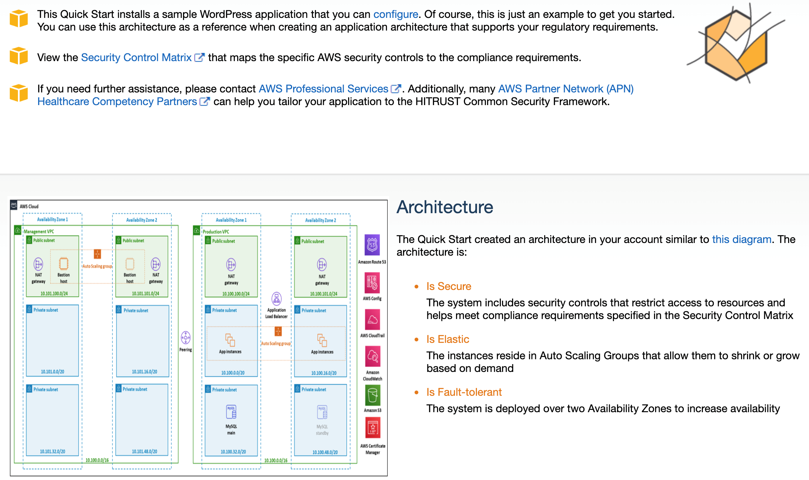
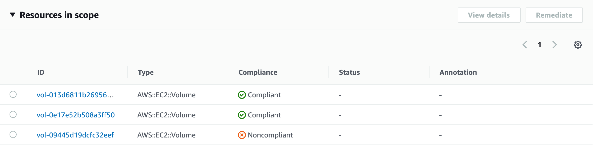
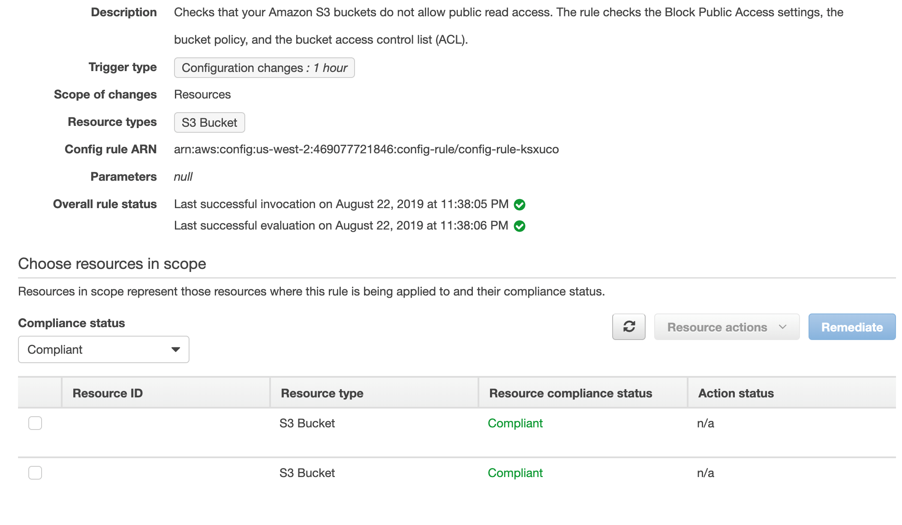

// Add steps as necessary for accessing the software, post-configuration, and testing. Don’t include full usage instructions for your software, but add links to your product documentation for that information.
//Should any sections not be applicable, remove them

== Test the deployment

1. Navigate to the landing page. In the *Outputs* tab shown in the previous figure, select LandingPageURL. If you click on the link, the following webpage appears.

[#test1]
.Confirmation on webpage after successful launch 

[start=2]
2. Next, confirm that WordPress is installed correctly. Note down the application URL and navigate to ApplicationURL/wordpress/. Enter the requisite information, if you choose to set up the site.
3. Navigate to the AWS Config console. Here, you can see the status of your configuration. Note that AWS Config will monitor all resources in the AWS Region you deploy in, not just what is in this particular Quick Start. For example, an Amazon Elastic Block Store (Amazon EBS) volume may not be encrypted elsewhere.

[#test2]
.Resource monitoring

[start=4]
4. You can also check that all your S3 buckets have public read access disabled.

[#test3]
.S3 buckets with public read access disabled

