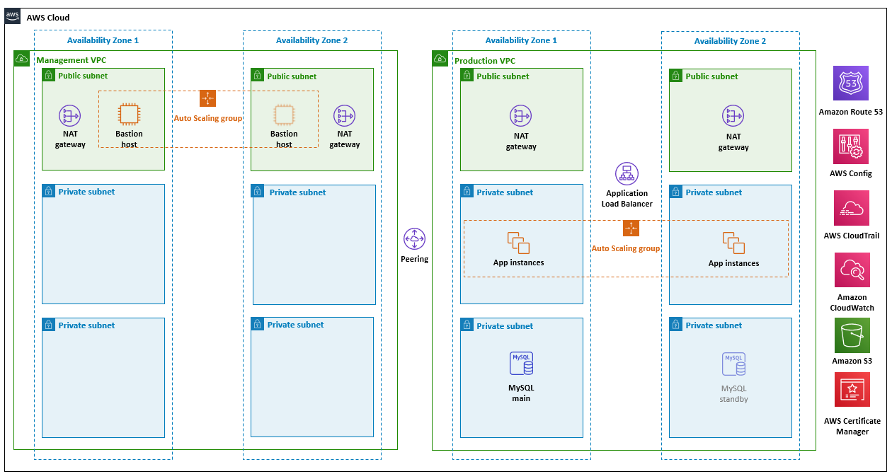

:xrefstyle: short

Deploying this Quick Start with default parameters builds the following {partner-product-short-name} environment in the AWS Cloud.

// Replace this example diagram with your own. Follow our wiki guidelines: https://w.amazon.com/bin/view/AWS_Quick_Starts/Process_for_PSAs/#HPrepareyourarchitecturediagram. Upload your source PowerPoint file to the GitHub {deployment name}/docs/images/ directory in this repo. 

[#architecture1]
.Quick Start architecture for {partner-product-short-name} on AWS

As shown in <<architecture1>>, the Quick Start sets up the following:

* A highly available architecture that spans two Availability Zones.
* A management VPC and production VPC configured with public and private subnets, according to AWS best practices, to provide you with your own virtual network on AWS. The management and production VPCs have VPC peering enabled.
* In the public subnets: 
** Managed network address translation (NAT) gateways to allow outbound internet access for resources in the private subnets.
** In the management VPC, a Linux bastion host in an Auto Scaling group to allow inbound Secure Shell (SSH) access to Amazon Elastic Compute Cloud (Amazon EC2) instances in the private subnets.
* Security groups for Amazon EC2 instances and load balancers, used in the sample application stack. The security groups limit access to only necessary services and disallow unencrypted traffic (for example, HTTP port 80).
* An Amazon Simple Storage Service (Amazon S3) bucket for encrypted log content.
* In the private subnets in the production VPC:
** An encrypted Multi-AZ Amazon Relational Database Service (Amazon RDS) MySQL database and a standby instance in a second private subnet.
** A three-tier Linux web application in an Auto Scaling group and an Application Load Balancer, which can be modified or bootstrapped with customer applications, such as WordPress.
* A Secure Sockets Layer (SSL) certificate, managed by AWS Certificate Manager (ACM), on the load balancer to encrypt all traffic between the internet and load balancer. Separate self-signed certificates are generated on the Amazon EC2 instances to encrypt traffic between the load balancer and application instances.
* AWS Config rules to monitor the deployment configuration. If you haven’t created a configuration recorder and delivery channel, this deployment creates them.
* An Amazon Route 53 record set that maps the fully qualified domain name (FQDN) to the load balancer Domain Name System (DNS).
* Logging, monitoring, and alerts using AWS CloudTrail, Amazon CloudWatch, and AWS Config rules.
